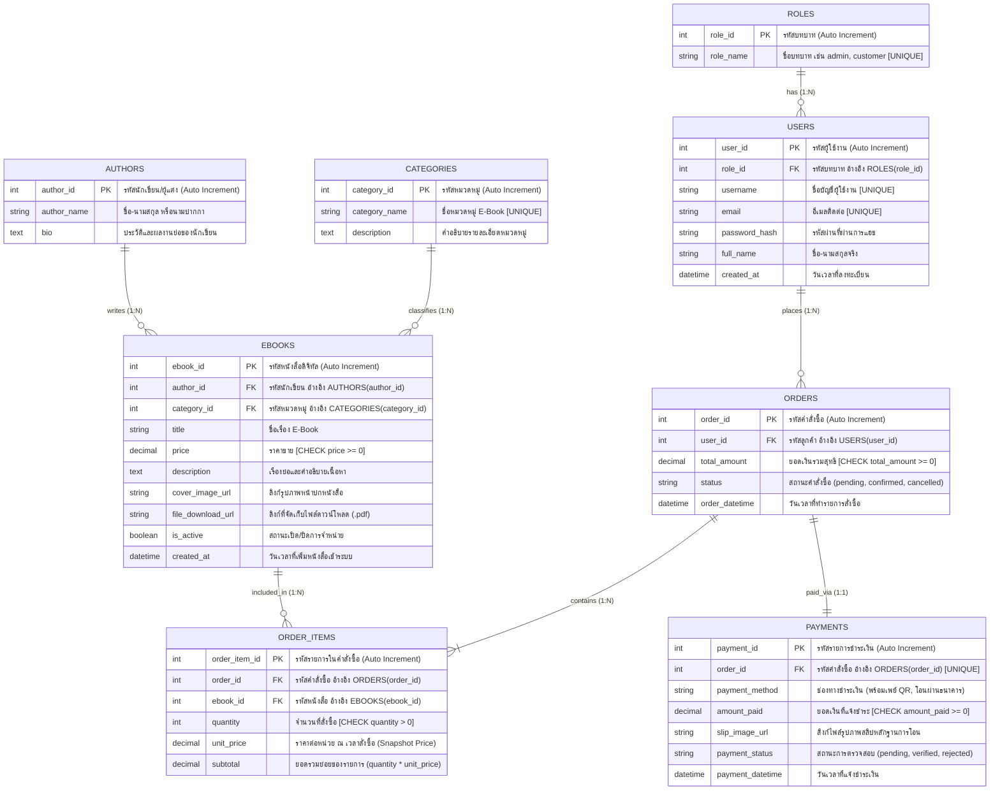

# 📊 ผังความสัมพันธ์ฐานข้อมูล (Entity-Relationship Diagram: ERD)
## ระบบร้านค้า E-Book ออนไลน์ (Bookie House)

เอกสารนี้แสดงโครงสร้างฐานข้อมูล 8 ตารางหลักของระบบร้านค้า E-Book ออนไลน์ ออกแบบตามหลักการออกแบบฐานข้อมูลเชิงสัมพันธ์ระดับ **Third Normal Form (3NF)** พร้อมระบุ Primary Key (PK), Foreign Key (FK), Constraints และความสัมพันธ์ของข้อมูล (Cardinality) ไว้อย่างครบถ้วน

---

### 1. แผนภาพ ER Diagram (8 ตารางหลัก)

---

### 2. ตารางสรุปความสัมพันธ์ของข้อมูล (Entity Relationships & Cardinality)

| ความสัมพันธ์ (Relationship) | ความสัมพันธ์แบบ (Cardinality) | คำอธิบายความสัมพันธ์เชิงธุรกิจ | Foreign Key Constraint |
| :--- | :---: | :--- | :--- |
| **ROLES $\rightarrow$ USERS** | `1 : N` | บทบาท 1 บทบาท สามารถกำหนดให้กับผู้ใช้ได้หลายคน แต่ผู้ใช้ 1 คนมีได้ 1 บทบาทหลัก | `ON DELETE RESTRICT` ป้องกันการลบบทบาทที่มีผู้ใช้อยู่ |
| **USERS $\rightarrow$ ORDERS** | `1 : N` | ลูกค้า 1 คน สามารถสร้างคำสั่งซื้อได้หลายครั้ง แต่ละคำสั่งซื้อต้องผูกกับลูกค้า 1 คน | `ON DELETE RESTRICT` ป้องกันการลบบัญชีผู้ใช้ที่มีประวัติคำสั่งซื้อ |
| **CATEGORIES $\rightarrow$ EBOOKS** | `1 : N` | หมวดหมู่ 1 หมวดหมู่ บรรจุ E-Book ได้หลายเล่ม แต่ละเล่มสังกัดหมวดหมู่หลัก 1 หมวดหมู่ | `ON DELETE RESTRICT` ป้องกันการลบหมวดหมู่ที่มีหนังสืออยู่ |
| **AUTHORS $\rightarrow$ EBOOKS** | `1 : N` | นักเขียน 1 คน สามารถแต่งหนังสือได้หลายเล่ม โดยหนังสือแต่ละเล่มอ้างอิงผู้แต่งหลัก | `ON DELETE RESTRICT` ป้องกันการลบประวัตินักเขียนที่มีผลงานในระบบ |
| **ORDERS $\rightarrow$ ORDER_ITEMS** | `1 : N` | คำสั่งซื้อ 1 รายการ ต้องมีรายการย่อยของหนังสืออย่างน้อย 1 รายการ | `ON DELETE CASCADE` หากคำสั่งซื้อถูกลบ รายการย่อยจะถูกลบตาม |
| **EBOOKS $\rightarrow$ ORDER_ITEMS** | `1 : N` | หนังสือ 1 เล่ม สามารถปรากฏในรายการสั่งซื้อของลูกค้าได้หลายคำสั่งซื้อ | `ON DELETE RESTRICT` ห้ามลบหนังสือที่มีการสั่งซื้อไปแล้ว |
| **ORDERS $\rightarrow$ PAYMENTS** | `1 : 1` | คำสั่งซื้อ 1 รายการ มีหลักฐานการชำระเงินจำลองผูกติดได้เพียง 1 รายการ (`UNIQUE`) | `ON DELETE CASCADE` ลบข้อมูลการชำระเงินตามคำสั่งซื้อ |

---

### 3. จุดเด่นการออกแบบตามหลัก 3NF และความปลอดภัยของข้อมูล

1. **Snapshot Pricing ในตาราง `ORDER_ITEMS`**:
   - บันทึกคอลัมน์ `unit_price` ณ ขณะทำการสั่งซื้อ เพื่อป้องกันปัญหาราคาประวัติศาสตร์เปลี่ยนแปลงเมื่อ Admin มีการปรับราคาขาย E-Book ในตาราง `EBOOKS` ในภายหลัง
2. **การแยก `AUTHORS` และ `CATEGORIES` ออกจาก `EBOOKS`**:
   - ป้องกันการเกิด Redundant Data และ Transitive Dependency (2NF/3NF) ทำให้การอัปเดตชื่อผู้แต่งหรือชื่อหมวดหมู่ทำได้ที่จุดเดียว
3. **การบังคับใช้ Business Constraints**:
   - ราคาและยอดเงินต้องไม่ติดลบ (`CHECK price >= 0`, `CHECK total_amount >= 0`, `CHECK amount_paid >= 0`)
   - จำนวนสินค้าต้องเป็นบวกเสมอ (`CHECK quantity > 0`)
   - ข้อมูลระบุตัวตนสำคัญห้ามซ้ำ (`UNIQUE` บน `username`, `email`, `category_name`, `role_name`, และ `order_id` ใน `PAYMENTS`)
