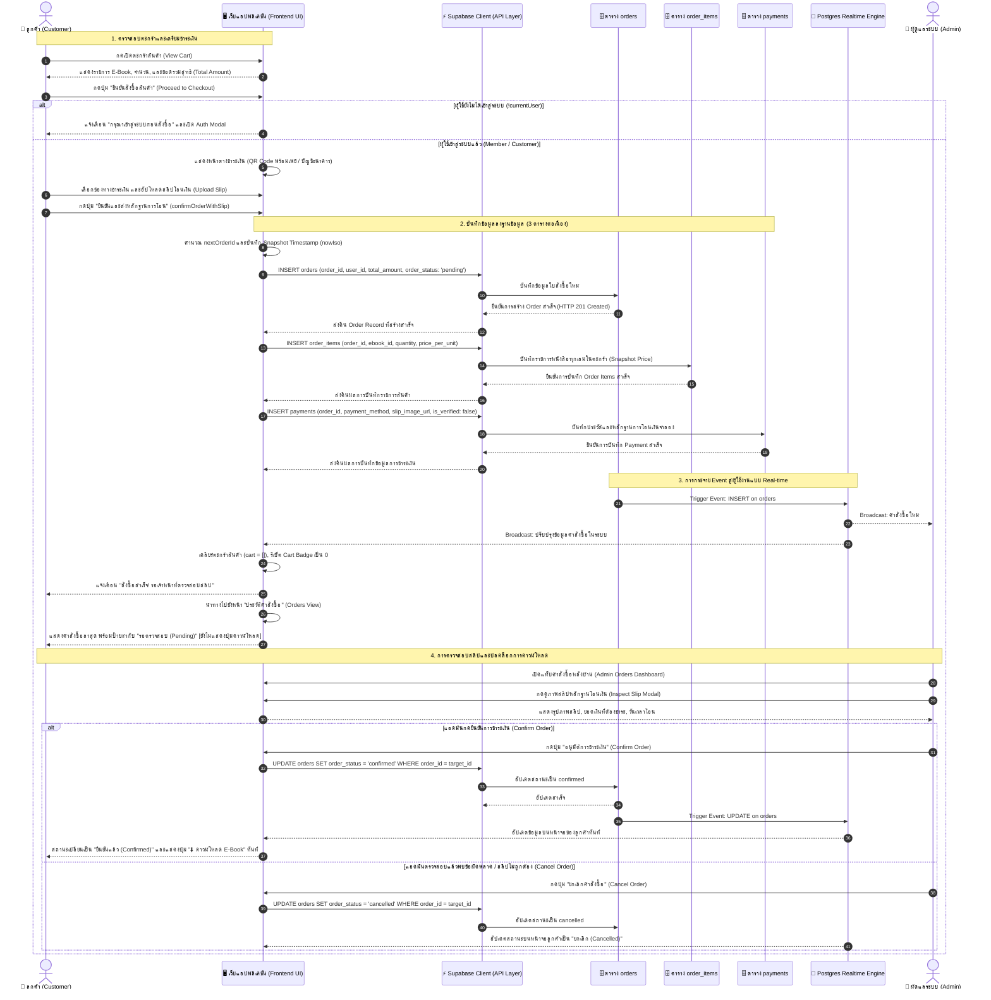

# 🔄 ลำดับขั้นตอนธุรกรรมการสั่งซื้อและชำระเงิน (Checkout Transaction Sequence Diagram)
## ระบบร้านค้า E-Book ออนไลน์ (Bookie House)

เอกสารนี้แสดงลำดับขั้นตอนการทำงาน (Sequence of Events) ตั้งแต่ลูกค้าเริ่มกดทำรายการสั่งซื้อ (Checkout) จากตะกร้าสินค้า การบันทึกข้อมูลธุรกรรมแบบหลายตาราง (Multi-table Transaction: `orders`, `order_items`, `payments`) การแจ้งเตือนแบบ Real-time จนถึงขั้นตอนที่ผู้ดูแลระบบตรวจสอบหลักฐานและอนุมัติคำสั่งซื้อ

---

### 1. แผนภาพ Sequence Diagram

---

### 2. คำอธิบายขั้นตอนสำคัญในกระบวนการทำงาน

| ลำดับที่ | ขั้นตอนหลัก (Process Phase) | กิจกรรมที่เกิดขึ้นในระบบ (System Activities) | การรับประกันความปลอดภัยและความถูกต้อง (Integrity & Guardrails) |
| :---: | :--- | :--- | :--- |
| **1 - 4** | **Cart & Checkout Validation** | ตรวจสอบตะกร้าสินค้า ยอดเงินรวม และตรวจสอบว่าผู้ใช้ได้เข้าสู่ระบบ (`currentUser`) หรือไม่ | ป้องกัน Guest สั่งซื้อ และป้องกันการสั่งซื้อขณะตะกร้าว่างเปล่า |
| **5 - 7** | **Simulated Payment Capture** | แสดงช่องทางชำระเงินจำลอง (QR / Bank Transfer) และให้แนบไฟล์สลิป | ไม่มีการขอข้อมูลบัตรเครดิตหรือข้อมูลทางการเงินจริง (Zero Financial Risk) |
| **8 - 11** | **Database Transaction Execution** | ส่งคำสั่งบันทึกลง 3 ตารางหลักตามลำดับความสัมพันธ์:  1. สร้าง Header ใน `orders` 2. สร้าง Lines ใน `order_items` 3. สร้าง Payment Record ใน `payments` | จัดเก็บ Snapshot Unit Price ป้องกันปัญหาราคาเปลี่ยนในอนาคต และตั้งสถานะเริ่มต้นเป็น `pending` เสมอ |
| **12 - 14** | **Real-time Event & State Reset** | Realtime Engine ส่งสัญญาณอัปเดตข้อมูลสู่ทุก Client, เคลียร์ตะกร้าในเครื่องลูกค้า และนำทางไปหน้าประวัติคำสั่งซื้อ | ข้อมูลออเดอร์ใหม่ปรากฏบนหน้าจอแอดมินทันทีโดยไม่ต้อง Refresh หน้าเว็บ |
| **15 - 19** | **Admin Verification & Order Settlement** | แอดมินตรวจสอบความถูกต้องของสลิป และปรับสถานะเป็น `confirmed` หรือ `cancelled` | ลิงก์ดาวน์โหลดจะยังถูกกั้นไว้ตลอดเวลาตราบใดที่สถานะยังไม่เป็น `confirmed` |
