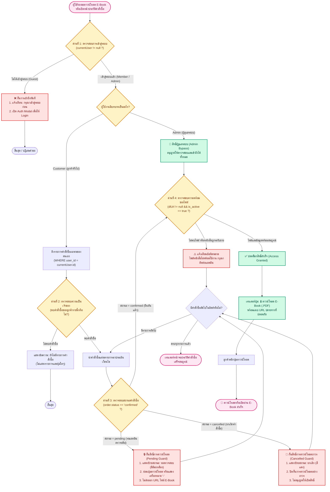

# 🛡️ ผังงานการตรวจสอบสิทธิ์การเข้าถึงไฟล์ดาวน์โหลด E-Book (Download Guardrail Flowchart)
## ระบบร้านค้า E-Book ออนไลน์ (Bookie House)

เอกสารนี้แสดงผังงานการทำงานของระบบควบคุมและตรวจสอบสิทธิ์หลายชั้น (Multi-layered Access Guardrails) เพื่อป้องกันไม่ให้ผู้ใช้งานหรือบุคคลภายนอกเข้าถึงลิงก์ดาวน์โหลดหนังสือดิจิทัล (E-Book File) โดยไม่ผ่านการชำระเงิน หรือคำสั่งซื้อยังไม่ได้รับการยืนยันสถานะเป็น `confirmed` จากผู้ดูแลระบบ

---

### 1. แผนภาพ Flowchart การตรวจสอบสิทธิ์การดาวน์โหลด



---

### 2. หลักการทำงานของ Guardrail 4 ระดับ (Defense-in-Depth)

| ระดับของ Guardrail | ประเภทการตรวจสอบ (Guardrail Type) | รายละเอียดเงื่อนไขการตรวจสอบ (Inspection Criteria) | ผลลัพธ์เมื่อไม่ผ่านเงื่อนไข (Failure Action) |
| :---: | :--- | :--- | :--- |
| **ด่านที่ 1** | **Authentication Guard** | ตรวจสอบว่าผู้ใช้มี Session การเข้าสู่ระบบที่ถูกต้อง (`currentUser != null`) | บล็อกการเข้าถึงหน้า Orders, ส่งไปยัง Auth Modal บังคับให้ล็อกอินก่อน |
| **ด่านที่ 2** | **Ownership & Tenant Isolation** | กรองเฉพาะคำสั่งซื้อที่เป็นของตนเองเท่านั้น (`user_id == currentUser.id`) | ป้องกัน IDOR (Insecure Direct Object Reference) ลูกค้าไม่สามารถดูออเดอร์ของผู้อื่นได้ |
| **ด่านที่ 3** | **Financial & Order Status Guard** | ตรวจสอบว่า `order.status` ต้องมีค่าเป็น **`'confirmed'`** เท่านั้น | หากเป็น `pending` หรือ `cancelled` ระบบจะซ่อนปุ่มดาวน์โหลดและไม่ปล่อย URL ไฟล์ออกมา |
| **ด่านที่ 4** | **Asset Integrity Guard** | ตรวจสอบว่าหนังสือเล่มดังกล่าวยังเปิดจำหน่าย (`is_active = true`) และมี URL ดาวน์โหลดที่ถูกต้อง | ป้องกันการเกิด Broken Link หรือไฟล์ที่ถูกยกเลิกการเผยแพร่ |

---

### 3. การแมปกับการทำงานในโค้ดจริง (`index.html`)

ในฟังก์ชัน `renderCustomerOrders()` ของระบบ มีการใช้ Guardrail นี้อย่างเคร่งครัด:

```javascript
// ตรวจสอบสิทธิ์การแสดงผลปุ่มดาวน์โหลดตามสถานะคำสั่งซื้อ (Guardrail Implementation)
let action = o.status === 'confirmed'
  ? `<a href="${o.dlUrl}" target="_blank" class="bg-gradient-to-r from-glam-rose to-glam-roseDark text-white text-xs px-3.5 py-2 rounded-xl font-bold shadow inline-block">⬇ ดาวน์โหลด</a>`
  : '<span class="text-xs text-stone-400 italic">-</span>';
```

- หาก `o.status === 'pending'` $\rightarrow$ แสดงเครื่องหมาย `-` (ไม่อนุญาตให้ดาวน์โหลด)
- หาก `o.status === 'cancelled'` $\rightarrow$ แสดงเครื่องหมาย `-` (ไม่อนุญาตให้ดาวน์โหลด)
- หาก `o.status === 'confirmed'` $\rightarrow$ เรนเดอร์ปุ่มดาวน์โหลดพร้อมลิงก์ไฟล์ PDF จริง
