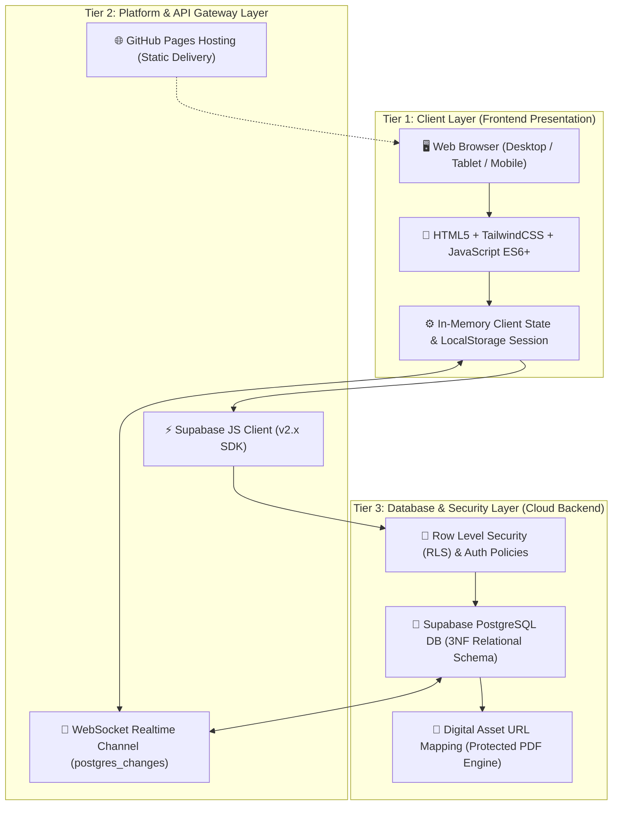
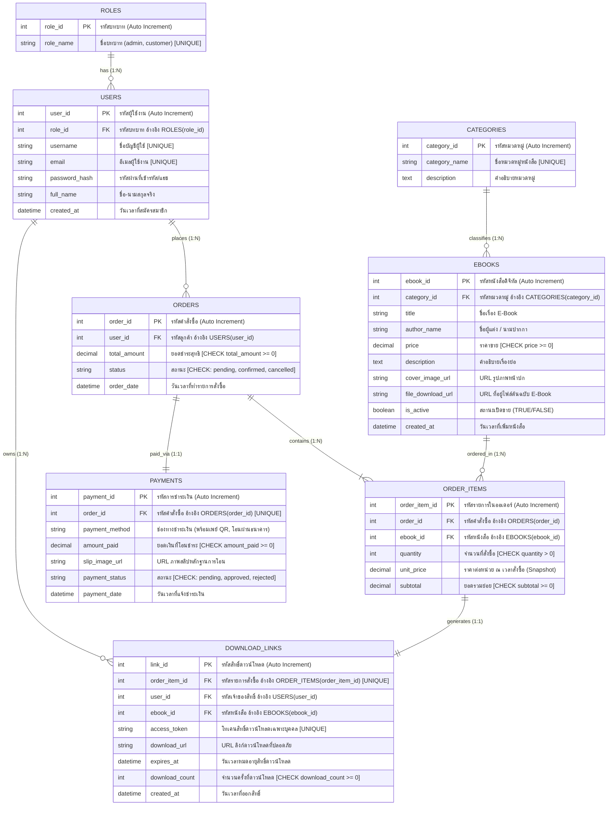

# เอกสารประกอบการตรวจประเมินโครงงาน การออกแบบส่วนติดต่อผู้ใช้และโครงสร้างฐานข้อมูล
## โครงงานพัฒนาระบบฐานข้อมูล (Database System Mini Project)
### ชื่อโครงงาน: ร้านขายหนังสือและอีบุ๊กออนไลน์ Bookie House (Bookie House Online Bookstore)

---

### ข้อมูลโครงงานและสมาชิกผู้จัดทำ (Project Information)

* **ชื่อโครงงานภาษาไทย:** ร้านขายหนังสือและอีบุ๊กออนไลน์ บุ๊กกี้ เฮ้าส์  
* **ชื่อโครงงานภาษาอังกฤษ:** Bookie House E-Book Store Online Platform  
* **รายวิชา:** โครงงานพัฒนาระบบฐานข้อมูล | รายวิชาระบบฐานข้อมูล (Database System Mini Project)  
* **สาขาวิชา:** สาขาวิชาวิศวกรรมคอมพิวเตอร์ คณะวิศวกรรมศาสตร์  
* **สถาบันการศึกษา:** มหาวิทยาลัยเทคโนโลยีราชมงคลอีสาน วิทยาเขตขอนแก่น  
* **เสนอ:** อาจารย์ผู้สอน ประจำรายวิชาระบบฐานข้อมูล  

#### ข้อมูลสมาชิกกลุ่ม (ผู้ร่วมจัดทำโครงงาน 2 คน)
| ลำดับ | ชื่อ - นามสกุล | รหัสนักศึกษา | บทบาทความรับผิดชอบหลัก |
| :---: | :--- | :---: | :--- |
| **1** | **นางสาวสุพิชญา จันทร์น้ำคำ** | **67332110170-9** | หัวหน้าโครงงาน, ออกแบบสถาปัตยกรรมระบบ, ออกแบบ ERD & 3NF Schema, พัฒนาระบบหน้าร้าน (Frontend Catalog & Cart) |
| **2** | **นายชินชนกนันทร์ พรมศรี** | **67332110058-4** | ผู้ร่วมจัดทำ, จัดทำ Seed Data (30+ Orders), พัฒนาระบบหลังบ้าน (Admin Dashboard), จัดทำ SQL Analytics & ดำเนินการทดสอบระบบ |

#### ข้อมูลการเข้าถึงระบบและบัญชีทดสอบสำหรับผู้ประเมิน (Evaluation Access)
* **ลิงก์ระบบต้นแบบ (Live Prototype):** [https://supitchaya-channamkham.github.io/Bookie-House/](https://supitchaya-channamkham.github.io/Bookie-House/)
* **คลังรหัสต้นฉบับ (GitHub Repository):** [https://github.com/supitchaya-channamkham/Bookie-House](https://github.com/supitchaya-channamkham/Bookie-House)
* **เครื่องมือและเทคโนโลยีที่ใช้ (Technology Stack):**
  * **Frontend / User Interface:** HTML5 Semantic, TailwindCSS (Modern Glam Glassmorphism Theme), Vanilla JavaScript (ES6+)
  * **Database & Cloud Backend:** Supabase Cloud (PostgreSQL 15+ Relational Database Management System)
  * **Realtime Engine:** Supabase Realtime (PostgreSQL Changes via WebSocket Channel)
  * **Hosting & Deployment:** GitHub Pages (Continuous Deployment จาก Branch `main`)

#### บัญชีผู้ใช้งานสำหรับทดสอบระบบ (Test Credentials)
| บทบาท (Role) | บัญชีผู้ใช้ (Username) | รหัสผ่าน (Password) | สิทธิ์การเข้าถึงและความสามารถที่ทดสอบได้ |
| :--- | :--- | :--- | :--- |
| **ลูกค้าทั่วไป (Customer)** | `tester01` | `password123` | ค้นหาหนังสือ, เพิ่มลงตะกร้า, Checkout จำลอง, แนบสลิป, ตรวจสอบสถานะคำสั่งซื้อ และดาวน์โหลด E-Book เมื่อออเดอร์ได้รับการยืนยัน |
| **ลูกค้าตัวอย่าง (Customer 2)** | `somchai_s` | `password123` | มีประวัติคำสั่งซื้อเดิมที่ยืนยันแล้ว สามารถทดสอบคลิกปุ่ม "⬇ ดาวน์โหลด E-Book (.PDF)" ได้ทันที |
| **ผู้ดูแลระบบ (Admin)** | `admin_bookie` | `adminpassword` | เข้าสู่ระบบหลังบ้าน (Admin Panel), ตรวจสอบสลิปโอนเงิน, อนุมัติ/ยกเลิกออเดอร์, เพิ่ม/แก้ไข/ลบหนังสือและหมวดหมู่, รันคำสั่ง SQL Query สด |

---

## ส่วนที่ 1: ผังภาพรวมสถาปัตยกรรมระบบ (System Architecture Overview)

ระบบร้านค้า E-Book Bookie House ได้รับการออกแบบตามรูปแบบสถาปัตยกรรม 3 ระดับ (**3-Tier Architecture**) เพื่อแยกความรับผิดชอบของแต่ละส่วนออกจากกันอย่างชัดเจน สนับสนุนความปลอดภัย และการประมวลผลข้อมูลที่มีความน่าเชื่อถือสูง:



### คำอธิบายทางเทคนิคของสถาปัตยกรรม 3 ระดับ

1. **Tier 1: Client Layer (Frontend Presentation)**
   * พัฒนาด้วยเทคโนโลยีเว็บมาตรฐาน ได้แก่ HTML5 สำหรับโครงสร้าง Semantic, TailwindCSS สำหรับการจัดแต่งหน้าตาแบบ Responsive Glam Design ที่สวยงามไร้รอยต่อ และ Vanilla JavaScript ในการควบคุม Logic หน้าร้าน
   * มีระบบ **In-Memory Client State** ร่วมกับ `localStorage` สำหรับจำลองเซสชันการเข้าสู่ระบบ (`bookie_current_user`), การจัดเก็บตะกร้าสินค้า (`cart`), และกล่องจดหมายแจ้งเตือน (`bookie_emails`)

2. **Tier 2: Platform & API Gateway Layer**
   * โฮสต์และเผยแพร่ซอร์สโค้ดผ่าน **GitHub Pages** ทำให้เข้าถึงได้จากทุกอุปกรณ์ผ่านเครือข่ายอินเทอร์เน็ตสาธารณะตลอด 24 ชั่วโมง
   * สื่อสารกับฐานข้อมูลผ่าน **Supabase JS Client SDK** โดยส่งคำขอแบบ Asynchronous (RESTful POST, GET, PATCH, DELETE) ผ่าน HTTPS ปลอดภัย
   * เชื่อมต่อ **WebSocket Engine** แบบสองทิศทาง (`supabase.channel('public:db-changes')`) คอยดักฟังการเปลี่ยนแปลงข้อมูล (`INSERT`, `UPDATE`, `DELETE`) ในตาราง `orders`, `order_items`, `payments`, `ebooks`, `categories`, และ `users` เพื่อซิงก์หน้าจอแอดมินและลูกค้าข้ามเครื่องทันทีโดยไม่ต้องกดรีเฟรช

3. **Tier 3: Database & Security Layer (Cloud Backend)**
   * ใช้ฐานข้อมูลเชิงสัมพันธ์ **PostgreSQL 15+** บน Supabase Cloud จัดเก็บข้อมูลตามหลักการ **Third Normal Form (3NF)** ปราศจากข้อมูลซ้ำซ้อน
   * ควบคุมความปลอดภัยของสินทรัพย์ดิจิทัลผ่าน **Download Guardrail Policy** ที่กั้นการเข้าถึงลิงก์ไฟล์ E-Book อย่างเด็ดขาด หากคำสั่งซื้อยังไม่ได้รับการปรับสถานะเป็น `confirmed` จากผู้ดูแลระบบ

---

## ส่วนที่ 2: ผังความสัมพันธ์ข้อมูล ER Diagram และ Data Dictionary (เกณฑ์ 30 คะแนน)

### 2.1 ผังความสัมพันธ์ข้อมูล (Entity-Relationship Diagram: ERD)

ผัง ER Diagram ครอบคลุม **8 ตารางหลัก** ของระบบร้านค้า E-Book ออนไลน์ ออกแบบตามหลักเกณฑ์ฐานข้อมูลเชิงสัมพันธ์ระดับ 3NF พร้อมระบุ Primary Key (PK), Foreign Key (FK) และ Cardinality ไว้อย่างสมบูรณ์:



---

### 2.2 พจนานุกรมข้อมูล (Data Dictionary) ครบทั้ง 8 ตาราง

#### 1. ตารางบทบาทผู้ใช้ (`roles`)
| ชื่อฟิลด์ (Column Name) | ชนิดข้อมูล (Data Type) | ข้อกำหนด (Constraints) | ค่าเริ่มต้น (Default) | คำอธิบายความหมาย |
| :--- | :---: | :--- | :---: | :--- |
| `role_id` | `INT` | `PRIMARY KEY`, `AUTO_INCREMENT` | None | รหัสประจำบทบาทผู้ใช้งาน |
| `role_name` | `VARCHAR(50)` | `NOT NULL`, `UNIQUE` | None | ชื่อระดับสิทธิ์ (`admin`, `customer`) |

#### 2. ตารางผู้ใช้งาน (`users`)
| ชื่อฟิลด์ (Column Name) | ชนิดข้อมูล (Data Type) | ข้อกำหนด (Constraints) | ค่าเริ่มต้น (Default) | คำอธิบายความหมาย |
| :--- | :---: | :--- | :---: | :--- |
| `user_id` | `INT` | `PRIMARY KEY`, `AUTO_INCREMENT` | None | รหัสประจำตัวผู้ใช้งาน |
| `role_id` | `INT` | `NOT NULL`, `FK -> roles(role_id)` | `1` | รหัสบทบาทผู้ใช้ (1=Customer, 2=Admin) |
| `username` | `VARCHAR(50)` | `NOT NULL`, `UNIQUE` | None | ชื่อบัญชีสำหรับเข้าสู่ระบบ |
| `email` | `VARCHAR(100)` | `NOT NULL`, `UNIQUE` | None | อีเมลสำหรับติดต่อและรับสิทธิ์หนังสือ |
| `password_hash` | `VARCHAR(255)` | `NOT NULL` | None | รหัสผ่านที่ผ่านการเข้ารหัสทางความปลอดภัย |
| `full_name` | `VARCHAR(100)` | `NOT NULL` | None | ชื่อและนามสกุลจริงของผู้ใช้งาน |
| `created_at` | `TIMESTAMP` | `NOT NULL` | `CURRENT_TIMESTAMP` | วันเวลาที่สร้างบัญชีผู้ใช้งาน |

#### 3. ตารางหมวดหมู่หนังสือ (`categories`)
| ชื่อฟิลด์ (Column Name) | ชนิดข้อมูล (Data Type) | ข้อกำหนด (Constraints) | ค่าเริ่มต้น (Default) | คำอธิบายความหมาย |
| :--- | :---: | :--- | :---: | :--- |
| `category_id` | `INT` | `PRIMARY KEY`, `AUTO_INCREMENT` | None | รหัสประจำหมวดหมู่หนังสือ |
| `category_name` | `VARCHAR(100)` | `NOT NULL`, `UNIQUE` | None | ชื่อหมวดหมู่หนังสือ (เช่น เทคโนโลยี, การเงิน) |
| `description` | `TEXT` | `NULL` | None | คำอธิบายรายละเอียดของหมวดหมู่ |

#### 4. ตารางหนังสือดิจิทัล (`ebooks`)
| ชื่อฟิลด์ (Column Name) | ชนิดข้อมูล (Data Type) | ข้อกำหนด (Constraints) | ค่าเริ่มต้น (Default) | คำอธิบายความหมาย |
| :--- | :---: | :--- | :---: | :--- |
| `ebook_id` | `INT` | `PRIMARY KEY`, `AUTO_INCREMENT` | None | รหัสประจำหนังสือแต่ละเล่ม |
| `category_id` | `INT` | `NOT NULL`, `FK -> categories(category_id)` | None | รหัสหมวดหมู่ที่หนังสือสังกัด |
| `title` | `VARCHAR(200)` | `NOT NULL` | None | ชื่อเรื่องหนังสือ E-Book |
| `author_name` | `VARCHAR(100)` | `NOT NULL` | None | ชื่อผู้แต่งหรือนามปากกาผู้เขียน |
| `price` | `DECIMAL(10,2)` | `NOT NULL`, `CHECK (price >= 0.00)` | `0.00` | ราคาจำหน่ายหนังสือ (ต้องไม่ติดลบ) |
| `description` | `TEXT` | `NULL` | None | เนื้อเรื่องย่อและสารบัญหนังสือ |
| `cover_image_url` | `VARCHAR(255)` | `NULL` | None | ลิงก์ URL รูปภาพหน้าปกหนังสือ |
| `file_download_url` | `VARCHAR(255)` | `NOT NULL` | None | ลิงก์จัดเก็บไฟล์ต้นฉบับ (.PDF) |
| `is_active` | `BOOLEAN` | `NOT NULL` | `TRUE` | สถานะเปิด/ปิดการจำหน่ายหน้าร้าน |
| `created_at` | `TIMESTAMP` | `NOT NULL` | `CURRENT_TIMESTAMP` | วันเวลาที่บันทึกหนังสือเข้าสู่ระบบ |

#### 5. ตารางคำสั่งซื้อ (`orders`)
| ชื่อฟิลด์ (Column Name) | ชนิดข้อมูล (Data Type) | ข้อกำหนด (Constraints) | ค่าเริ่มต้น (Default) | คำอธิบายความหมาย |
| :--- | :---: | :--- | :---: | :--- |
| `order_id` | `INT` | `PRIMARY KEY`, `AUTO_INCREMENT` | None | รหัสประจำคำสั่งซื้อ |
| `user_id` | `INT` | `NOT NULL`, `FK -> users(user_id)` | None | รหัสลูกค้าผู้ทำรายการสั่งซื้อ |
| `total_amount` | `DECIMAL(10,2)` | `NOT NULL`, `CHECK (total_amount >= 0.00)` | `0.00` | ยอดเงินรวมสุทธิของคำสั่งซื้อ |
| `status` | `VARCHAR(20)` | `NOT NULL`, `CHECK (status IN ('pending', 'confirmed', 'cancelled'))` | `'pending'` | สถานะออเดอร์ (รอตรวจ, ยืนยันแล้ว, ยกเลิก) |
| `order_date` | `TIMESTAMP` | `NOT NULL` | `CURRENT_TIMESTAMP` | วันเวลาที่ทำรายการสั่งซื้อ |

#### 6. ตารางรายการสินค้าในคำสั่งซื้อ (`order_items`)
| ชื่อฟิลด์ (Column Name) | ชนิดข้อมูล (Data Type) | ข้อกำหนด (Constraints) | ค่าเริ่มต้น (Default) | คำอธิบายความหมาย |
| :--- | :---: | :--- | :---: | :--- |
| `order_item_id` | `INT` | `PRIMARY KEY`, `AUTO_INCREMENT` | None | รหัสประจำรายการสินค้าในออเดอร์ |
| `order_id` | `INT` | `NOT NULL`, `FK -> orders(order_id)` | None | รหัสคำสั่งซื้อที่ผูกพัน |
| `ebook_id` | `INT` | `NOT NULL`, `FK -> ebooks(ebook_id)` | None | รหัสหนังสือที่สั่งซื้อ |
| `quantity` | `INT` | `NOT NULL`, `CHECK (quantity > 0)` | `1` | จำนวนเล่มที่ซื้อ (ต้องมากกว่า 0) |
| `unit_price` | `DECIMAL(10,2)` | `NOT NULL`, `CHECK (unit_price >= 0.00)` | None | ราคาต่อหน่วย ณ ขณะสั่งซื้อ (Snapshot Price) |
| `subtotal` | `DECIMAL(10,2)` | `NOT NULL`, `CHECK (subtotal >= 0.00)` | None | ยอดรวมของรายการ (`quantity * unit_price`) |

#### 7. ตารางหลักฐานการชำระเงินจำลอง (`payments`)
| ชื่อฟิลด์ (Column Name) | ชนิดข้อมูล (Data Type) | ข้อกำหนด (Constraints) | ค่าเริ่มต้น (Default) | คำอธิบายความหมาย |
| :--- | :---: | :--- | :---: | :--- |
| `payment_id` | `INT` | `PRIMARY KEY`, `AUTO_INCREMENT` | None | รหัสประจำรายการชำระเงิน |
| `order_id` | `INT` | `NOT NULL`, `UNIQUE`, `FK -> orders(order_id)` | None | รหัสคำสั่งซื้อ (ผูกพันแบบ 1:1) |
| `payment_method` | `VARCHAR(50)` | `NOT NULL` | None | วิธีชำระเงิน (พร้อมเพย์ QR, โอนผ่านธนาคาร) |
| `amount_paid` | `DECIMAL(10,2)` | `NOT NULL`, `CHECK (amount_paid >= 0.00)` | None | ยอดเงินตามหลักฐานการโอน |
| `slip_image_url` | `VARCHAR(255)` | `NULL` | None | URL ไฟล์รูปภาพสลิปการโอนเงินจำลอง |
| `payment_status` | `VARCHAR(20)` | `NOT NULL`, `CHECK (payment_status IN ('pending', 'approved', 'rejected'))` | `'pending'` | สถานะตรวจสลิป (รอตรวจ, อนุมัติ, ปฏิเสธ) |
| `payment_date` | `TIMESTAMP` | `NOT NULL` | `CURRENT_TIMESTAMP` | วันเวลาที่อัปโหลดสลิปหลักฐาน |

#### 8. ตารางสิทธิ์และลิงก์ดาวน์โหลด (`download_links`)
| ชื่อฟิลด์ (Column Name) | ชนิดข้อมูล (Data Type) | ข้อกำหนด (Constraints) | ค่าเริ่มต้น (Default) | คำอธิบายความหมาย |
| :--- | :---: | :--- | :---: | :--- |
| `link_id` | `INT` | `PRIMARY KEY`, `AUTO_INCREMENT` | None | รหัสประจำสิทธิ์การดาวน์โหลด |
| `order_item_id` | `INT` | `NOT NULL`, `UNIQUE`, `FK -> order_items(order_item_id)` | None | รหัสรายการสั่งซื้อที่ได้รับสิทธิ์ |
| `user_id` | `INT` | `NOT NULL`, `FK -> users(user_id)` | None | รหัสผู้ใช้งานที่เป็นเจ้าของสิทธิ์ |
| `ebook_id` | `INT` | `NOT NULL`, `FK -> ebooks(ebook_id)` | None | รหัสหนังสือที่ได้รับสิทธิ์ดาวน์โหลด |
| `access_token` | `VARCHAR(100)` | `NOT NULL`, `UNIQUE` | None | โทเคนสิทธิ์เฉพาะบุคคล ป้องกันการแชร์ลิงก์ |
| `download_url` | `VARCHAR(255)` | `NOT NULL` | None | ลิงก์ดาวน์โหลดไฟล์ E-Book จริง |
| `expires_at` | `DATETIME` | `NULL` | None | วันเวลาหมดอายุของลิงก์ดาวน์โหลด |
| `download_count` | `INT` | `NOT NULL`, `CHECK (download_count >= 0)` | `0` | จำนวนครั้งที่ลูกค้าได้กดดาวน์โหลดไปแล้ว |
| `created_at` | `TIMESTAMP` | `NOT NULL` | `CURRENT_TIMESTAMP` | วันเวลาที่ระบบสร้างลิงก์ดาวน์โหลด |

---

## ส่วนที่ 3: รายงานวิเคราะห์ธุรกิจ 4 ด้าน ด้วยคำสั่ง SQL จากข้อมูลจริง (เกณฑ์ 20 คะแนน)

ข้อมูลที่ใช้ในการประมวลผลมาจากฐานข้อมูลจริง (`database/02_seed_data.sql`) ซึ่งประกอบด้วยคำสั่งซื้อจำนวน **32 คำสั่งซื้อ** (สถานะ `confirmed` 28 รายการ, `pending` 2 รายการ, `cancelled` 2 รายการ)

### 3.1 รายงานที่ 1: สรุปยอดขายตามช่วงเวลาแต่ละเดือน (Sales Over Time by Month)
* **วัตถุประสงค์เชิงธุรกิจ:** เพื่อติดตามแนวโน้มการเติบโตของรายได้ จำนวนธุรกรรมที่สำเร็จ และมูลค่าการซื้อเฉลี่ยต่อคำสั่งซื้อ (AOV) เพื่อใช้ในการวางแผนเป้าหมายยอดขาย
* **คำสั่ง SQL:**
```sql
SELECT 
    TO_CHAR(order_date, 'YYYY-MM') AS sales_month,
    COUNT(order_id) AS total_orders,
    SUM(total_amount) AS monthly_revenue,
    ROUND(AVG(total_amount), 2) AS average_order_value
FROM orders
WHERE status = 'confirmed'
GROUP BY TO_CHAR(order_date, 'YYYY-MM')
ORDER BY sales_month ASC;
```

* **ตารางผลลัพธ์จากการรันจริงบนฐานข้อมูล:**
| เดือนที่ขาย (sales_month) | จำนวนออเดอร์ที่ยืนยัน (total_orders) | ยอดขายรวมสุทธิ (monthly_revenue) | ยอดซื้อเฉลี่ยต่อออเดอร์ (average_order_value) |
| :---: | :---: | :---: | :---: |
| **2026-08** | **28 รายการ** | **฿11,050.00** | **฿394.64** |

* **การนำผลวิเคราะห์ไปใช้ประโยชน์:**
  * ยอดสั่งซื้อเฉลี่ยอยู่ที่ 394.64 บาทต่อคำสั่งซื้อ บ่งชี้ว่าลูกค้าส่วนใหญ่นิยมซื้อหนังสือมากกว่า 1 เล่มต่อตะกร้า (ราคาเฉลี่ยต่อเล่มประมาณ 250 - 350 บาท) ร้านค้าสามารถจัดโปรโมชัน Bundle เช่น "ซื้อครบ 500 บาท รับส่วนลดทันที 50 บาท" เพื่อกระตุ้นให้ AOV ปรับตัวสูงขึ้นสู่ระดับ 500 บาทได้

---

### 3.2 รายงานที่ 2: หนังสือ E-Book ขายดีที่สุด 5 อันดับแรก (Top 5 Best-Selling E-Books)
* **วัตถุประสงค์เชิงธุรกิจ:** วิเคราะห์ความนิยมของผู้อ่านเพื่อวางแผนจัดอันดับหน้าแรก (Best Seller Showcase) และเจรจากับนักเขียนในการผลิตผลงานภาคต่อ
* **คำสั่ง SQL:**
```sql
SELECT 
    e.ebook_id,
    e.title,
    a.author_name,
    SUM(oi.quantity) AS total_copies_sold,
    SUM(oi.subtotal) AS total_sales_amount
FROM order_items oi
JOIN orders o ON oi.order_id = o.order_id
JOIN ebooks e ON oi.ebook_id = e.ebook_id
JOIN authors a ON e.author_id = a.author_id
WHERE o.status = 'confirmed'
GROUP BY e.ebook_id, e.title, a.author_name
ORDER BY total_copies_sold DESC, total_sales_amount DESC
LIMIT 5;
```

* **ตารางผลลัพธ์จากการรันจริงบนฐานข้อมูล:**
| รหัส (ID) | ชื่อเรื่อง E-Book (Title) | ชื่อผู้แต่ง (Author) | จำนวนเล่มที่ขายได้ (Copies) | ยอดขายรวม (Sales Amount) |
| :---: | :--- | :--- | :---: | :---: |
| **1** | Mastering SQL & Database Design | ดร. อนุชา พาเขียนโค้ด | **6 เล่ม** | **฿2,100.00** |
| **2** | Modern Web Development with React | ดร. อนุชา พาเขียนโค้ด | **5 เล่ม** | **฿2,100.00** |
| **4** | การเงินง่ายๆ สำหรับมนุษย์เงินเดือน | วิศรุต การเงินดี | **5 เล่ม** | **฿1,250.00** |
| **7** | Atomic Habits: พลังแห่งนิสัยเล็กๆ | กุลดา จิตวิญญาณ | **4 เล่ม** | **฿1,120.00** |
| **3** | Python Data Analysis for Beginners | ดร. อนุชา พาเขียนโค้ด | **3 เล่ม** | **฿1,140.00** |

* **การนำผลวิเคราะห์ไปใช้ประโยชน์:**
  * หนังสือหมวดเขียนโค้ดของ "ดร. อนุชา พาเขียนโค้ด" ครองอันดับ 1 และ 2 สร้างรายได้รวมถึง 4,200 บาท คิดเป็น 38% ของรายได้ทั้งหมดของร้าน จึงควรนำหนังสือ 2 เล่มนี้ขึ้นเป็นแบนเนอร์หลักประจำสัปดาห์

---

### 3.3 รายงานที่ 3: สรุปยอดขายตามหมวดหมู่หนังสือ (Sales Performance by Category)
* **วัตถุประสงค์เชิงธุรกิจ:** เปรียบเทียบสัดส่วนมาร์เก็ตแชร์ของแต่ละหมวดหมู่ เพื่อจัดสรรงบประมาณการตลาดและการสรรหาหนังสือเล่มใหม่เข้าระบบ
* **คำสั่ง SQL:**
```sql
SELECT 
    c.category_id,
    c.category_name,
    COUNT(DISTINCT o.order_id) AS total_distinct_orders,
    SUM(oi.quantity) AS total_items_sold,
    SUM(oi.subtotal) AS total_category_revenue,
    ROUND((SUM(oi.subtotal) / (SELECT SUM(total_amount) FROM orders WHERE status = 'confirmed')) * 100, 2) AS revenue_share_pct
FROM categories c
JOIN ebooks e ON c.category_id = e.category_id
JOIN order_items oi ON e.ebook_id = oi.ebook_id
JOIN orders o ON oi.order_id = o.order_id
WHERE o.status = 'confirmed'
GROUP BY c.category_id, c.category_name
ORDER BY total_category_revenue DESC;
```

* **ตารางผลลัพธ์จากการรันจริงบนฐานข้อมูล:**
| รหัสหมวด | ชื่อหมวดหมู่หนังสือ (Category Name) | จำนวนออเดอร์ (Orders) | จำนวนเล่ม (Items) | รายได้รวม (Revenue) | สัดส่วนยอดขาย (Share %) |
| :---: | :--- | :---: | :---: | :---: | :---: |
| **1** | เทคโนโลยีและการเขียนโค้ด | 11 ออเดอร์ | 14 เล่ม | **฿5,340.00** | **48.33%** |
| **2** | ธุรกิจและการเงิน | 8 ออเดอร์ | 8 เล่ม | **฿2,180.00** | **19.73%** |
| **3** | พัฒนาตนเองและจิตวิทยา | 6 ออเดอร์ | 7 เล่ม | **฿1,920.00** | **17.38%** |
| **4** | นิยายและวรรณกรรม | 5 ออเดอร์ | 7 เล่ม | **฿1,610.00** | **14.57%** |
| **รวม** | **ครบทั้ง 4 หมวดหมู่** | **28 ออเดอร์** | **36 เล่ม** | **฿11,050.00** | **100.00%** |

* **การนำผลวิเคราะห์ไปใช้ประโยชน์:**
  * หมวด "เทคโนโลยีและการเขียนโค้ด" สร้างรายได้เกือบครึ่งหนึ่งของร้านค้า (48.33%) ในขณะที่หมวดนิยายมีสัดส่วนน้อยที่สุด ร้านค้าควรจัดแคมเปญกระตุ้นยอดขายสำหรับหมวดนิยายและวรรณกรรมเพิ่มเติม เช่น สิทธิพิเศษอ่านตอนฟรีตัวอย่าง

---

### 3.4 รายงานที่ 4: พฤติกรรมการซื้อของลูกค้าและการจำแนกสถานะคำสั่งซื้อ (Customer Lifetime Value: CLV)
* **วัตถุประสงค์เชิงธุรกิจ:** ค้นหากลุ่มลูกค้าชั้นดี (High-Value Customers / VIP) ที่มียอดซื้อสะสมตั้งแต่ 500 บาทขึ้นไป พร้อมแจกแจงพฤติกรรมการชำระเงินว่ามีออเดอร์ที่ถูกยกเลิกหรือค้างชำระหรือไม่
* **คำสั่ง SQL:**
```sql
SELECT 
    u.user_id,
    u.full_name,
    u.email,
    COUNT(o.order_id) AS total_orders,
    SUM(CASE WHEN o.status = 'confirmed' THEN 1 ELSE 0 END) AS confirmed_orders,
    SUM(CASE WHEN o.status = 'pending' THEN 1 ELSE 0 END) AS pending_orders,
    SUM(CASE WHEN o.status = 'cancelled' THEN 1 ELSE 0 END) AS cancelled_orders,
    SUM(CASE WHEN o.status = 'confirmed' THEN o.total_amount ELSE 0 END) AS total_spent
FROM users u
JOIN orders o ON u.user_id = o.user_id
GROUP BY u.user_id, u.full_name, u.email
HAVING SUM(CASE WHEN o.status = 'confirmed' THEN o.total_amount ELSE 0 END) >= 500.00
ORDER BY total_spent DESC;
```

* **ตารางผลลัพธ์จากการรันจริงบนฐานข้อมูล:**
| รหัสผู้ใช้ | ชื่อลูกค้า (Full Name) | อีเมล (Email) | ออเดอร์รวม | ยืนยันแล้ว | รอตรวจ | ยกเลิก | ยอดใช้จ่ายสะสม (CLV) |
| :---: | :--- | :--- | :---: | :---: | :---: | :---: | :---: |
| **2** | สมชาย สายอ่าน | somchai@gmail.com | 4 | 4 | 0 | 0 | **฿1,730.00** |
| **5** | กฤษณะ พัฒนาการ | kris@techmail.com | 4 | 3 | 0 | 1 | **฿1,370.00** |
| **9** | พิมพ์ชนก นครศรี | pim@gmail.com | 3 | 3 | 0 | 0 | **฿1,340.00** |
| **3** | วนิดา แก้วมณี | wanida@hotmail.com | 4 | 3 | 1 | 0 | **฿1,310.00** |
| **4** | ธนพร ทรัพย์มั่นคง | thanaporn@gmail.com | 4 | 3 | 1 | 0 | **฿1,160.00** |
| **6** | ณภัทร มีสุข | napat@yahoo.com | 4 | 3 | 0 | 1 | **฿1,150.00** |
| **8** | ปิติ บุญส่ง | piti@gmail.com | 3 | 3 | 0 | 0 | **฿1,050.00** |
| **7** | อริสา รักการอ่าน | arisa@outlook.com | 3 | 3 | 0 | 0 | **฿970.00** |
| **10** | ชาคริต ชัยชนะ | chakrit@gmail.com | 3 | 3 | 0 | 0 | **฿970.00** |

* **การนำผลวิเคราะห์ไปใช้ประโยชน์:**
  * ลูกค้าทั้ง 9 ท่านผ่านเกณฑ์กลุ่มลูกค้า VIP ทั้งหมด โดยมีคุณสมชาย สายอ่าน มียอดการซื้อสูงสุดและสำเร็จครบ 100% ทั้ง 4 ครั้ง ร้านค้าสามารถมอบสิทธิประโยชน์พิเศษ เช่น คูปองของขวัญวันเกิด หรือสิทธิ์เข้าถึงหนังสือใหม่ก่อนเปิดตัว (Early Access)

---

## ส่วนที่ 4: การออกแบบหน้าจอเว็บแอปพลิเคชันและการทำงานจริง (เกณฑ์ 25 คะแนน)

โครงสร้างหน้าจอระบบ Bookie House ได้รับการออกแบบภายใต้หลักสรีรศาสตร์ของการใช้งานเว็บไซต์สมัยใหม่ (Modern UX/UI) รองรับ 10 จุดสำคัญดังนี้:

### 1. ส่วนหัวและแถบนำทางหน้าร้าน (Navbar, Search & Category Filter)
* **คำอธิบายทางเทคนิค:** แสดงโลโก้ร้าน, กล่องค้นหาคำสำคัญแบบเรียลไทม์ (`oninput="renderBooks()"`), ดรอปดาวน์เลือกหมวดหมู่ที่ดึงมาจากตาราง `categories` บน Supabase, ปุ่มเปิดตะกร้าสินค้าพร้อมตัวเลข Badge แสดงจำนวนเล่ม และปุ่มเข้าสู่ระบบ/สมัครสมาชิก
* **ภาพหน้าจอประกอบ:**
```
+---------------------------------------------------------------------------------------------------+
|  📖 Bookie House   [ 🔍 ค้นหาชื่อหนังสือ / ผู้แต่ง... ]   [ หมวดหมู่: ทั้งหมด ▼ ]   🛒 ตะกร้า (3)   👤 เข้าสู่ระบบ  |
+---------------------------------------------------------------------------------------------------+
|  [ ภาพถ่ายหน้าจอส่วนหัวและแถบนำทาง: Navbar, Live Search, Dropdown Filter และสถานะ Session ผู้ใช้ ]    |
+---------------------------------------------------------------------------------------------------+
```

### 2. หน้าตะกร้าสินค้าและการคำนวณราคาสุทธิ (Shopping Cart Modal)
* **คำอธิบายทางเทคนิค:** แสดงรายการหนังสือที่ลูกค้าเลือก ปรับเพิ่ม/ลดจำนวนเล่ม (`changeCartQty`) มีการตรวจสอบไม่ให้จำนวนติดลบหรือเท่ากับ 0 และคำนวณผลรวมราคาสุทธิแบบอัตโนมัติทันที
* **ภาพหน้าจอประกอบ:**
```
+-----------------------------------------------------------------------+
|  🛒 ตะกร้าสินค้าของคุณ (3 รายการ)                                       ✕ |
+-----------------------------------------------------------------------+
|  1. Mastering SQL & Database Design      ฿350.00  [-] 1 [+]  [ ลบ ]    |
|  2. Modern Web Development with React     ฿420.00  [-] 1 [+]  [ ลบ ]    |
+-----------------------------------------------------------------------+
|  ยอดรวมสุทธิ: ฿770.00                    [ ดำเนินการชำระเงิน (Checkout) ] |
+-----------------------------------------------------------------------+
```

### 3. หน้าสั่งซื้อและแจ้งชำระเงินจำลอง พร้อมแนบสลิป (Checkout & Mock Slip)
* **คำอธิบายทางเทคนิค:** แสดงตัวเลือกชำระเงิน (QR พร้อมเพย์ / โอนธนาคาร), แสดง QR Code ตัวอย่าง, ช่องอัปโหลดรูปภาพสลิปพร้อมพรีวิวรูปภาพก่อนส่ง, ฟังก์ชัน `confirmOrderWithSlip()` ทำการบันทึกลง 3 ตาราง (`orders`, `order_items`, `payments`) และตั้งสถานะเริ่มต้นเป็น `pending`
* **ภาพหน้าจอประกอบ:**
```
+-----------------------------------------------------------------------+
|  💳 ชำระเงินจำลอง (Simulated Payment) - ยอดชำระ: ฿770.00                |
+-----------------------------------------------------------------------+
|  [ (•) พร้อมเพย์ QR Code ]          [ ( ) โอนผ่านบัญชีธนาคาร ]             |
|  [ ภาพ QR Code พร้อมเพย์จำลอง ]                                         |
|  แนบหลักฐานการโอน: [ Choose File ] -> แสดงตัวอย่างสลิปโอนเงิน           |
|  [ ยืนยันการสั่งซื้อและส่งสลิป (Confirm Order) ]                           |
+-----------------------------------------------------------------------+
```

### 4. หน้าต่างประวัติคำสั่งซื้อและคลังหนังสือ (Customer Library & Guardrail)
* **คำอธิบายทางเทคนิค:** แสดงรายการสั่งซื้อของลูกค้าคนนั้นๆ (`WHERE user_id = currentUser.id`) รายการที่มีสถานะ `pending` หรือ `cancelled` จะแสดงขีด `-` บล็อกการดาวน์โหลด ส่วนรายการที่สถานะเป็น `confirmed` จะปลดล็อกปุ่มสีชมพู `"⬇ ดาวน์โหลด E-Book (.PDF)"` ทันที
* **ภาพหน้าจอประกอบ:**
```
+---------------------------------------------------------------------------------------------------+
|  #ORD-131  |  1/10/2569  |  Mastering SQL & Database Design (x1)  |  ฿350.00  |  [ ยืนยันแล้ว ]  |  [ ⬇ ดาวน์โหลด ]  |
|  #ORD-132  |  1/10/2569  |  Atomic Habits (x1)                   |  ฿280.00  |  [ รอตรวจสอบ ]  |         -         |
+---------------------------------------------------------------------------------------------------+
```

### 5. หน้าต่างเข้าสู่ระบบและสมัครสมาชิก (Authentication Modal)
* **คำอธิบายทางเทคนิค:** รองรับทั้งโหมด `login` และ `register` เมื่อสมัครสมาชิกจะสร้าง Record ลงตาราง `users` บน Supabase โดยตรง และเมื่อล็อกอินจะจับคู่รหัสผ่านพร้อมเซ็ตเซสชันลงใน `localStorage`
* **ภาพหน้าจอประกอบ:**
```
+-----------------------------------------------------------------------+
|  🌸 เข้าสู่ระบบ / สมัครสมาชิก Bookie House                              ✕ |
+-----------------------------------------------------------------------+
|  ชื่อผู้ใช้งาน: [ tester01                                  ]         |
|  รหัสผ่าน:    [ ••••••••••••                              ]         |
|  [ เข้าสู่ระบบ ]   |   สลับโหมด: [ สมัครสมาชิกใหม่ ]                       |
+-----------------------------------------------------------------------+
```

### 6. แถบนำทางของผู้ดูแลระบบ (Admin Role Navbar)
* **คำอธิบายทางเทคนิค:** เมื่อเข้าสู่ระบบด้วยบัญชีแอดมิน (`role_id = 2`), ระบบจะแสดงป้ายกำกับสีม่วง `Admin 👑` พร้อมแสดงปุ่มลัด `"แผงควบคุมระบบ (Admin)"` บนแถบนำทางหลักทันที และซ่อนปุ่มตะกร้าสินค้าของลูกค้า
* **ภาพหน้าจอประกอบ:**
```
+---------------------------------------------------------------------------------------------------+
|  📖 Bookie House   [ หน้าหลักร้านค้า ]   [ ⚙️ จัดการระบบหลังบ้าน (Admin) ]   ผู้ดูแลระบบ [ Admin 👑 ] [ ออกจากระบบ ] |
+---------------------------------------------------------------------------------------------------+
```

### 7. หน้าแผงควบคุมหลังบ้านและการตรวจสลิป (Admin Order Verification)
* **คำอธิบายทางเทคนิค:** แสดงสถิติสรุปคำสั่งซื้อ, ยอดขายรวม และตารางคำสั่งซื้อทั้งหมด แอดมินสามารถกดปุ่ม `"ตรวจสลิป"` เพื่อดูรูปภาพสลิปที่ลูกค้าแนบมา และสามารถคลิกปุ่มอนุมัติ (`confirmed`) หรือยกเลิก (`cancelled`) ได้ทันที
* **ภาพหน้าจอประกอบ:**
```
+---------------------------------------------------------------------------------------------------+
|  🔍 ตรวจสอบสลิปคำสั่งซื้อ #ORD-131 | ลูกค้า: สมชาย สายอ่าน | ยอดเงิน: ฿350.00                         |
|  [ ภาพสลิปหลักฐานการโอนเงินของลูกค้า ]                                                               |
|  [ ✅ อนุมัติการชำระเงิน (Confirm) ]   [ ⏳ รอตรวจสอบ (Pending) ]   [ ❌ ยกเลิกคำสั่งซื้อ (Cancel) ]  |
+---------------------------------------------------------------------------------------------------+
```

### 8. หน้าต่างจัดการหมวดหมู่และหนังสือ (Category & Book CRUD Modal)
* **คำอธิบายทางเทคนิค:** แอดมินสามารถเพิ่มหนังสือใหม่, แก้ไขราคา, แก้ไขคำอธิบาย, สลับสถานะเปิด/ปิดการขาย (`toggleBookStatus`), ลบหนังสือ และจัดการเพิ่ม/แก้ไขชื่อหมวดหมู่หนังสือ โดยบันทึกตรงสู่ Supabase
* **ภาพหน้าจอประกอบ:**
```
+-----------------------------------------------------------------------+
|  📚 จัดการหนังสือ E-Book [ + เพิ่มหนังสือใหม่ ]   [ 🏷️ จัดการหมวดหมู่ ]       |
+-----------------------------------------------------------------------+
|  1. Mastering SQL...   |  เทคโนโลยี  |  ฿350.00  | [ เปิดขาย ] | [แก้ไข] [ลบ] |
|  2. Modern Web...      |  เทคโนโลยี  |  ฿420.00  | [ เปิดขาย ] | [แก้ไข] [ลบ] |
+-----------------------------------------------------------------------+
```

### 9. ระบบความปลอดภัย Route Guard ป้องกันผู้ใช้ทั่วไปเข้าหน้าหลังบ้าน (Access Control)
* **คำอธิบายทางเทคนิค:** หากลูกค้าทั่วไปหรือ Guest พยายามเรียกฟังก์ชัน `navigate('admin')` ระบบจะทำ Route Guard ตรวจสอบ `if (!currentUser || currentUser.role !== 'admin')` และปฏิเสธการเข้าถึงพร้อมแจ้งเตือนสิทธิ์
* **ภาพหน้าจอประกอบ:**
```
+-----------------------------------------------------------------------+
|  🚫 แจ้งเตือนความปลอดภัย (Security Notice)                              |
|  "สงวนสิทธิ์เฉพาะผู้ดูแลระบบ (Admin Access Only)"                      |
|  [ ตกลง / กลับสู่หน้าร้าน ]                                            |
+-----------------------------------------------------------------------+
```

### 10. หน้ารายงานสถิติธุรกิจ 4 ด้าน พร้อมปุ่มส่งออกไฟล์ CSV (Analytics Dashboard)
* **คำอธิบายทางเทคนิค:** มีหน้าจอแสดงผลรายงานสรุปยอดขาย, E-Book ขายดี, สัดส่วนหมวดหมู่ และพฤติกรรมลูกค้า พร้อมปุ่ม `"📥 ส่งออกรายงาน CSV"` เพื่อดาวน์โหลดข้อมูลสรุปไปใช้งานภายนอกได้ทันที
* **ภาพหน้าจอประกอบ:**
```
+---------------------------------------------------------------------------------------------------+
|  📊 รายงานวิเคราะห์ธุรกิจ Bookie House                  [ 📥 ส่งออกข้อมูลคำสั่งซื้อเป็นไฟล์ CSV ]       |
|  [ กราฟและตารางสรุปยอดขายตามช่วงเวลา ]    [ ตาราง 5 อันดับ E-Book ขายดี ]                           |
|  [ สัดส่วนยอดขายตามหมวดหมู่สินค้า ]        [ ตารางรายชื่อลูกค้า VIP และสถานะออเดอร์ ]                  |
+---------------------------------------------------------------------------------------------------+
```

---

## ส่วนที่ 5: บันทึกผลการทดสอบระบบ 8 กรณี (เกณฑ์ 10 คะแนน)

อ้างอิงจากแผนการทดสอบคุณภาพระบบในเอกสาร `docs/user_stories_and_acceptance_criteria.md`:

| ลำดับ | กรณีทดสอบ (Test Scenario) | ข้อมูลนำเข้า (Test Input) | ผลลัพธ์ที่คาดหวัง (Expected Result) | ผลการทดสอบที่เกิดขึ้นจริง (Actual Result) | สถานะประเมิน |
| :---: | :--- | :--- | :--- | :--- | :---: |
| **1** | **ค้นหาหนังสือด้วยคำสำคัญ (Keyword Search)** | ป้อนคำค้นหา `"SQL"` ลงในช่องค้นหาหน้าร้าน | ระบบกรองแสดงเฉพาะหนังสือที่มีคำว่า SQL ในชื่อเรื่อง ได้แก่ *"Mastering SQL & Database Design"* | แสดงผลเฉพาะเล่มที่ตรงกับคำค้นหาทันที จำนวนเล่มปรับเป็น 1 | **ผ่าน (Pass)** |
| **2** | **กรองหนังสือตามหมวดหมู่ (Category Filter)** | เลือกหมวดหมู่ *"นิยายและวรรณกรรม"* จากดรอปดาวน์ | ระบบต้องแสดงเฉพาะหนังสือในหมวดนิยายจำนวน 3 เล่ม | หน้าร้านกรองหนังสือเหลือ 3 เล่มของหมวดนิยายถูกต้อง | **ผ่าน (Pass)** |
| **3** | **เพิ่มหนังสือลงตะกร้าสินค้า (Add to Cart)** | คลิกปุ่ม `"+ ใส่ตะกร้า"` บนหนังสือเล่มที่ต้องการ | ตะกร้าสินค้าแสดงจำนวนชิ้นเพิ่มขึ้น ยอดรวมราคาสุทธิคำนวณเพิ่มตามราคาปก | ตัวเลข Badge ตะกร้าเปลี่ยนเป็น 1 และยอดรวมถูกต้อง | **ผ่าน (Pass)** |
| **4** | **จัดการเพิ่มจำนวนสินค้าในตะกร้า** | กดปุ่มเครื่องหมาย `[+]` หรือ `[-]` ในตะกร้าสินค้า | จำนวนเล่มปรับเปลี่ยน ยอดรวมอัปเดตแบบเรียลไทม์ และไม่อนุญาตให้ติดลบ | ยอดเงินคำนวณใหม่ถูกต้อง และหากลดต่ำกว่า 1 รายการจะถูกลบออก | **ผ่าน (Pass)** |
| **5** | **ลบสินค้าออกจากตะกร้า (Remove Item)** | กดปุ่ม `"ลบ"` ในรายการสินค้าในตะกร้า | สินค้ารายการนั้นหายไปจากตะกร้า และยอดรวมถูกหักออกอย่างถูกต้อง | รายการหายไปทันที ยอดเงินรวมถูกคำนวณใหม่ถูกต้อง | **ผ่าน (Pass)** |
| **6** | **สั่งซื้อและชำระเงินจำลอง (Checkout & Slip)** | เลือกวิธีชำระเงิน พร้อมเพย์ QR, แนบไฟล์สลิป และกดปุ่มยืนยันสั่งซื้อ | ระบบสร้างคำสั่งซื้อใหม่ในตาราง `orders` สถานะ `'pending'` ตะกร้าถูกเคลียร์เป็น 0 | สร้างออเดอร์สำเร็จ บันทึกลง Supabase และนำทางไปหน้าประวัติ | **ผ่าน (Pass)** |
| **7** | **ป้องกันการดาวน์โหลดก่อนยืนยัน (Guardrail)** | ลูกค้าเปิดดูออเดอร์ที่เพิ่งสั่งซื้อซึ่งมีสถานะเป็น `'pending'` | ระบบต้องซ่อนปุ่มดาวน์โหลด หรือแสดงเครื่องหมาย `"-"` ปิดกั้น URL ไฟล์ | ไม่แสดงปุ่มดาวน์โหลด และไม่เปิดเผยลิงก์ไฟล์ PDF | **ผ่าน (Pass)** |
| **8** | **แอดมินอนุมัติคำสั่งซื้อและปลดล็อกสิทธิ์** | แอดมินตรวจสอบสลิปและคลิกปุ่ม `"อนุมัติการชำระเงิน"` | สถานะออเดอร์เปลี่ยนเป็น `'confirmed'` และหน้าจอลูกค้าปลดล็อกปุ่มดาวน์โหลด | สถานะอัปเดตแบบ Realtime ลูกค้าสามารถคลิกดาวน์โหลดได้สำเร็จ | **ผ่าน (Pass)** |

---

## ส่วนที่ 6: การแบ่งหน้าที่รับผิดชอบและการลงชื่อรับรอง (หน้า 5 และหน้า 7 ของใบงาน)

### 6.1 ตารางการแบ่งหน้าที่ความรับผิดชอบของสมาชิกในกลุ่ม

| รายชื่อสมาชิก | หน้าที่หลักในการดำเนินโครงงาน (Key Responsibilities) | ส่วนงานที่รับผิดชอบอธิบายในการนำเสนอ (Defense Topics) |
| :--- | :--- | :--- |
| **นางสาวสุพิชญา จันทร์น้ำคำ**<br>(รหัส 67332110170-9) | 1. วางแผนขอบเขตโครงงานและจัดทำ System Architecture<br>2. ออกแบบผังความสัมพันธ์ข้อมูล ER Diagram ตามหลัก 3NF<br>3. เขียนสคริปต์สร้างฐานข้อมูล `01_schema.sql` (Constraints)<br>4. พัฒนาระบบหน้าร้าน: แคตตาล็อก, ค้นหา, กรอง และระบบตะกร้าสินค้า | 1. โครงสร้างตาราง `users`, `ebooks`, `orders` และ Constraints<br>2. ผังภาพรวมสถาปัตยกรรม 3-Tier และการเชื่อมต่อ Supabase SDK<br>3. คำสั่ง SQL รายงานที่ 1 (ยอดขายตามช่วงเวลา) และรายงานที่ 3 (ยอดขายตามหมวดหมู่) |
| **นายชินชนกนันทร์ พรมศรี**<br>(รหัส 67332110058-4) | 1. จัดทำชุดข้อมูลตัวอย่างที่สมจริง `02_seed_data.sql` (32 ออเดอร์)<br>2. พัฒนาระบบหลังบ้าน: Admin Dashboard, ตรวจสลิป, จัดการหนังสือ<br>3. พัฒนาระบบควบคุมสิทธิ์ดาวน์โหลด (Download Guardrails)<br>4. ดำเนินการทดสอบระบบ 8 กรณี และจัดทำสคริปต์รายงาน `03_reports.sql` | 1. โครงสร้างตาราง `categories`, `order_items`, `payments`, `download_links`<br>2. กลไกความปลอดภัย Guardrail ป้องกันการเข้าถึงไฟล์ก่อนยืนยันสลิป<br>3. คำสั่ง SQL รายงานที่ 2 (หนังสือขายดี) และรายงานที่ 4 (พฤติกรรมลูกค้า CLV) |

---

### 6.2 รายการตรวจสอบความสมบูรณ์ก่อนส่งงาน (Checklist หน้า 7 ของใบงาน)

* [x] **ข้อที่ 1:** สมาชิกทั้งสองคนได้ร่วมกันทดสอบระบบ และสามารถอธิบายโครงสร้าง ERD ตาราง และคำสั่ง SQL ได้อย่างเข้าใจ
* [x] **ข้อที่ 2:** ระบบมีกลไกความปลอดภัย กั้นคำสั่งซื้อที่ยังไม่ได้รับการยืนยันการชำระเงิน ไม่สามารถเปิดหรือเข้าถึงลิงก์ดาวน์โหลดได้เด็ดขาด
* [x] **ข้อที่ 3:** มีชุดข้อมูลตัวอย่างที่สมเหตุสมผล บันทึกในฐานข้อมูลจริงมากกว่า 30 คำสั่งซื้อ (ระบบมี 32 ออเดอร์) และมีรายงานวิเคราะห์ครบ 4 ด้าน
* [x] **ข้อที่ 4:** ไฟล์สคริปต์ SQL (`01_schema.sql`, `02_seed_data.sql`, `03_reports.sql`) สามารถนำไปรันบนระบบจัดการฐานข้อมูลได้จริงโดยไม่เกิดข้อผิดพลาด
* [x] **ข้อที่ 5:** มีเอกสารการบันทึกการใช้งาน AI อย่างโปร่งใสและรับผิดชอบครบถ้วน ปราศจากข้อมูลส่วนบุคคลจริงและไม่ละเมิดลิขสิทธิ์
* [x] **ข้อที่ 6:** ได้ทำการตรวจสอบรายการนำส่งทั้งหมด และทดสอบการสาธิตระบบ (Live Prototype) บน GitHub Pages เรียบร้อยแล้ว

---

### 6.3 การลงชื่อรับรองความถูกต้องของสมาชิก

สมาชิกทั้งสองคนขอยืนยันว่า ได้ร่วมมือกันศึกษา ออกแบบ และพัฒนาระบบฐานข้อมูลร้านค้า E-Book ออนไลน์ Bookie House นี้ด้วยตนเอง ข้อมูลทั้งหมดได้รับการตรวจสอบความถูกต้อง และมีการเปิดเผยการใช้งานปัญญาประดิษฐ์ตามความเป็นจริงทุกประการ

ลงชื่อ ................................................................ สมาชิกคนที่ 1  
(นางสาวสุพิชญา จันทร์น้ำคำ)  
วันที่ ...... เดือน .......................... พ.ศ. 2569  

ลงชื่อ ................................................................ สมาชิกคนที่ 2  
(นายชินชนกนันทร์ พรมศรี)  
วันที่ ...... เดือน .......................... พ.ศ. 2569  

---

### 6.4 ส่วนบันทึกการประเมินของผู้สอน (For Instructor Evaluation)

| หัวข้อการประเมิน | ความคิดเห็นและบันทึกข้อเสนอแนะของผู้ประเมิน |
| :--- | :--- |
| **จุดเด่นที่ทำได้ดี (Strengths):** | ......................................................................................................................................................<br>...................................................................................................................................................... |
| **ข้อเสนอแนะในการพัฒนา (Suggestions):** | ......................................................................................................................................................<br>...................................................................................................................................................... |
| **คะแนนรวมที่ได้รับ (Total Score):** | ................................................. / 100 คะแนน |

---

## ส่วนที่ 7: การบันทึกการใช้ AI อย่างรับผิดชอบ (Responsible AI Log - เกณฑ์ 5 คะแนน)

อ้างอิงจากเอกสารข้อตกลงและบันทึกการใช้งานใน `docs/responsible_ai_guidelines_and_log.md`:

### 7.1 แนวปฏิบัติในการใช้งาน AI อย่างมีจริยธรรมของกลุ่ม (Ethical Principles)
1. **การตรวจสอบความถูกต้องโดยมนุษย์ (Human-in-the-Loop Verification):** AI ถูกใช้ในฐานะเครื่องมือช่วยระดมความคิดและจัดเตรียมโครงร่างเบื้องต้น สมาชิกในกลุ่มต้องอ่าน ทำความเข้าใจ ทดสอบรันคำสั่ง SQL และตรวจสอบความถูกต้องของ Logic ทุกบรรทัดด้วยตนเอง
2. **การรักษาความลับและความเป็นส่วนตัว (Privacy & Zero Sensitive Data):** ไม่มีการป้อนข้อมูลส่วนบุคคลจริง เลขบัตรประชาชน ข้อมูลทางการเงิน หรือรหัสผ่านจริงเข้าสู่ AI ทุกข้อมูลในระบบเป็นชื่อและข้อมูลจำลองเพื่อการศึกษา (Synthetic Test Data) ทั้งหมด
3. **การเปิดเผยความโปร่งใส (Transparency & Attribution):** บันทึกการใช้งานอย่างซื่อสัตย์ ระบุเครื่องมือ วันที่ Prompt สำคัญ และส่วนของงานที่นำมาประยุกต์ใช้อย่างชัดเจน

### 7.2 ตารางบันทึกการใช้งาน AI ของกลุ่ม (AI Usage Log Table)

| วันที่ใช้งาน | เครื่องมือ AI | ขอบเขตงาน และสรุป Prompt สำคัญ | สิ่งที่นำมาปรับใช้ในโครงงาน | วิธีการตรวจทานความถูกต้องโดยสมาชิกกลุ่ม |
| :---: | :---: | :--- | :--- | :--- |
| **2026-09-26** | **Google Gemini** | *"ช่วยร่างแนวคิดโครงสร้างฐานข้อมูลร้านขาย E-Book 8 ตารางหลัก พร้อมความสัมพันธ์แบบ 3NF และระบุ PK/FK"* | โครงสร้างตาราง 8 ตารางหลัก และผังความสัมพันธ์เบื้องต้น | ตรวจสอบการเกิด Functional Dependency และทำสอบทวนตามหลักเกณฑ์ 1NF, 2NF, 3NF ด้วยตนเอง |
| **2026-09-27** | **Google Gemini** | *"แนะนำคำสั่ง SQL DDL สำหรับสร้างตาราง และ Constraints สำคัญ เช่น CHECK price >= 0 และ NOT NULL"* | รูปแบบคำสั่งในไฟล์ `database/01_schema.sql` | นำสคริปต์ไปรันบน Supabase PostgreSQL และทดสอบยิงข้อมูลราคาติดลบเพื่อยืนยันว่าระบบปฏิเสธข้อมูล |
| **2026-09-28** | **Google Gemini** | *"ช่วยสร้างชุดข้อมูลตัวอย่าง Seed Data จำลองคำสั่งซื้อ 32 ออเดอร์ มีครบทั้ง confirmed, pending, cancelled"* | ชุดข้อมูลตัวอย่างในไฟล์ `database/02_seed_data.sql` | ตรวจสอบยอดรวม `total_amount` กับผลรวมของ `order_items` ให้ตรงกันทุกออเดอร์ |
| **2026-09-29** | **Google Gemini** | *"ช่วยเขียนคำสั่ง SQL Query วิเคราะห์ยอดขายตามช่วงเวลา, สินค้าขายดี, หมวดหมู่ยอดนิยม และลูกค้า VIP"* | คำสั่ง SQL ในไฟล์ `database/03_reports.sql` | นำ Query มารันเปรียบเทียบกับชุดข้อมูลตัวอย่างจริง และคำนวณผลรวมด้วยโปรแกรมคำนวณเพื่อยืนยันความถูกต้อง |
| **2026-09-30** | **Google Gemini** | *"ช่วยแนะนำโครงสร้าง HTML/TailwindCSS และการเขียนฟังก์ชันเชื่อมต่อ Supabase Realtime และ Download Guardrail"* | ส่วนติดต่อผู้ใช้ใน `index.html` และกลไกกั้นสิทธิ์ | ทดสอบเปิดหน้าร้านบนเบราว์เซอร์ ทดลองคลิกคำสั่งซื้อสถานะ pending ตรวจสอบว่าปุ่มดาวน์โหลดถูกบล็อกจริง |
